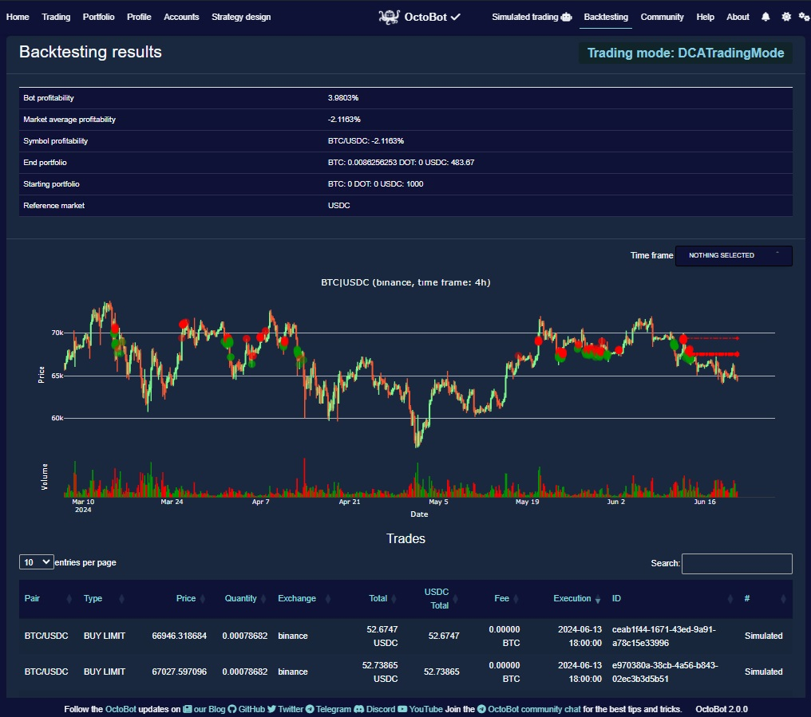

<p align="center">
  
</p>

<h1 align="center">⚡ Cross-Chain Arbitrage Alert Bot</h1>
<p align="center">
  <strong>Detect arbitrage opportunities between blockchains — not just exchanges</strong>
</p>

<p align="center">
  <a href="https://t.me/spidertrading100">
    
  </a>
  <a href="https://t.me/spidertrading100">
    
  </a>
</p>

---

## 💡 The New Idea

Most arbitrage bots only monitor **exchanges** — comparing prices across Binance, Kraken, Coinbase, etc.

**This project does something different:** it detects arbitrage **between blockchains**.

| Traditional Bots | This Bot |
|------------------|----------|
| Same chain, different exchanges | **Different chains, same token** |
| Buy low on Exchange A, sell high on Exchange B | **Buy low on Chain A, sell high on Chain B** |
| Intra-exchange price gaps | **Cross-chain price discrepancies** |

---

## 📊 How It Works

- **Token is cheaper on one chain** (e.g., Polygon)
- **Same token is more expensive on another chain** (e.g., Ethereum)
- **Profit** = Buy on the cheaper chain → Bridge/Transfer → Sell on the expensive chain

---

## 🔔 Example Alert

```
╔══════════════════════════════════════════╗
║   CROSS-CHAIN ARBITRAGE OPPORTUNITY      ║
╠══════════════════════════════════════════╣
║   Token:     USDC                        ║
║   Buy:       Polygon                     ║
║   Sell:      Ethereum                    ║
║   Profit:    1.2%                        ║
╚══════════════════════════════════════════╝
```

---

## 📱 Contact — Spider Trading

<div align="center">

### [🔗 https://t.me/spidertrading100](https://t.me/spidertrading100)

**Get alerts. Get opportunities. Get in touch.**

</div>

---

## 📁 Project Structure

```
Cross-Chain-Arbitrage-Alert-Bot/
│
├── 📂 src/                      # Main frontend (React + Vite)
│   ├── components/              # Dashboard, charts, UI
│   │   └── Dashboard.tsx        # Crypto data display
│   ├── stories/                 # Storybook components
│   ├── App.tsx
│   └── main.tsx
│
├── 📂 backend/                  # Python FastAPI backend
│   ├── api/
│   │   ├── app.py               # Main API routes
│   │   └── historicaldata.py    # Historical data endpoints
│   ├── data/                    # Data fetchers
│   │   ├── fetchBinance.py
│   │   ├── fetchBitvavo.py
│   │   └── fetchBitvavoWithBacktesting.py
│   ├── models/                  # Database models
│   ├── app.py
│   └── main.py
│
├── 📂 bot/                      # Trading bot logic
│   ├── data/                    # Market data & APIs
│   │   ├── fetchBinance.py
│   │   ├── fetchBitvavo.py
│   │   ├── fetchCoinGecko.py
│   │   └── indicators.py
│   ├── models/                  # ML models (LSTM, XGBoost, etc.)
│   ├── strategies/              # Trading strategies
│   ├── trading-bot-frontend/    # Bot UI
│   └── frontend/                # React frontend
│
├── 📂 frontend/                 # Standalone frontend
│   ├── dashboard.html
│   ├── login.html
│   └── styles.css
│
├── 📂 AutoCryptoTraderBot/      # Vue.js trading UI
│
├── 📂 assets/                   # Images & media
│   └── backtesting-report.png
│
├── package.json
├── vite.config.ts
└── Launch_Instructions.txt
```

---

## 🚀 Quick Start

### Backend
```bash
cd backend
pip install -r requirements.txt
uvicorn app:app --reload
```

### Frontend
```bash
npm install
npm run dev
```

---

## 📈 Backtesting

The project includes backtesting capabilities to validate strategies before live execution. See the sample report above for profitability metrics, candlestick charts, and trade history.

---

<p align="center">
  <strong>Telegram:</strong> <a href="https://t.me/spidertrading100">@spidertrading100</a> — Spider Trading
</p>
